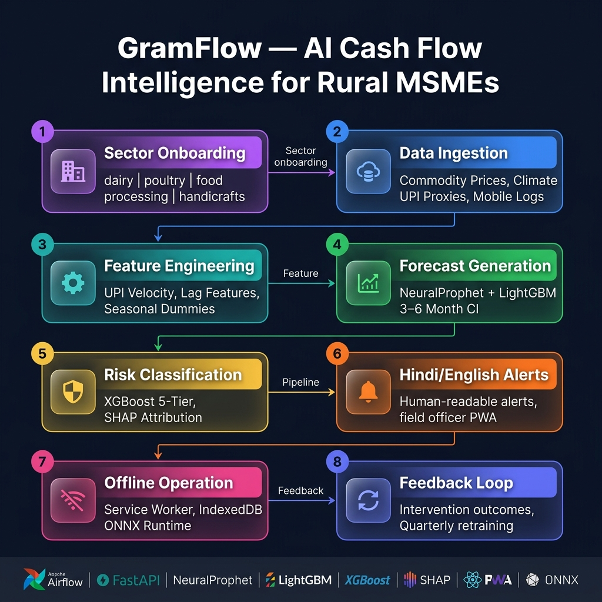

# GramFlow: cash-flow risk API prototype for rural MSMEs (NABARD, Round 1)

**Status: prototype. The API returns randomly generated mock forecasts and mock SHAP values. No models are trained or served in this repo.**

GramFlow was a Round 1 submission for a NABARD rural-innovation challenge. The idea: forecast cash flow for rural micro-enterprises (dairy, poultry, food processing, handicrafts), put each one in a 5-tier risk band, and send field officers a short explanation in Hindi or English.

This repo contains the **API contract and a demo**, not the ML pipeline.


*The diagram shows the proposed design (Airflow ingestion, NeuralProphet / LightGBM forecasting, XGBoost + SHAP risk, offline PWA with ONNX). None of those components is implemented here.*

## What works today
| Piece | What it actually does |
|---|---|
| `api/main.py` (FastAPI) | `POST /v1/onboard`, `POST /v1/ingest`, `GET /v1/forecast/{id}`, `GET /v1/risk/{id}`, `GET /health`, with Pydantic v2 request/response models in `api/models.py` |
| Onboarding | Returns a sector template: risk-factor weights, seasonal peaks and troughs, key inputs |
| Forecast endpoint | **Mock:** random base level, random trend and Gaussian noise (`_mock_forecast_series`) |
| Risk endpoint | **Mock:** random risk score and random SHAP-style attributions (`_mock_shap_features`), formatted into a Hindi/English alert string |
| Ingest endpoint | **Mock:** returns random record counts; nothing is fetched |
| `generate_mock_data.py` | Writes synthetic daily data for 4 enterprises per sector to `data/mock/` |
| `notebooks/gramflow_demo.ipynb` | Feature engineering (rolling UPI velocity, lags, seasonal flags) on the synthetic data. Its outputs were **pre-filled by `build_notebook.py`**. They report "Prophet not installed — using synthetic forecast" and "Using synthetic SHAP values", so no forecast or SHAP model was actually fitted |

## Not implemented (design only)
Airflow ingestion, AGMARKNET / eNAM / IMD / UPI data sources, NeuralProphet / Prophet / LightGBM forecasting, XGBoost risk classification, real SHAP, the field-officer PWA, offline Service Worker / IndexedDB / ONNX Runtime, and the retraining feedback loop.

## Run
```bash
pip install fastapi "uvicorn[standard]" pydantic pandas numpy
python generate_mock_data.py
uvicorn api.main:app --reload --port 8000   # docs at http://localhost:8000/docs
```
`requirements.txt` also lists prophet, neuralprophet, lightgbm, xgboost and shap. The API does not need them. They are only for the notebook's optional branches.

## Next steps
1. Fit a real baseline forecast (e.g., Prophet or LightGBM) on the synthetic data, report error on a held-out window, and serve it from `/v1/forecast`.
2. Train the risk classifier, compute real SHAP values, and replace the random ones.
3. Add tests for the API contract.

## Stack
Python, FastAPI, Pydantic v2, pandas, NumPy.

## Licence
No LICENSE file is included yet. Add one (e.g., MIT) before relying on it.
